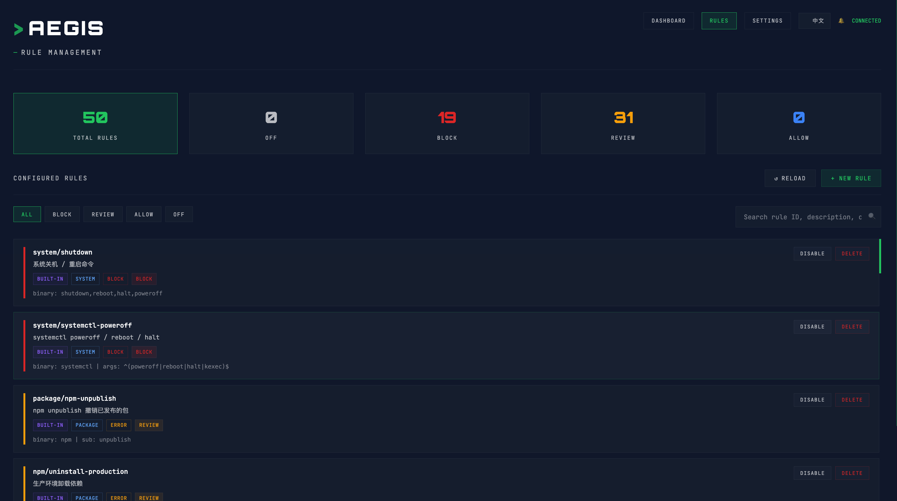
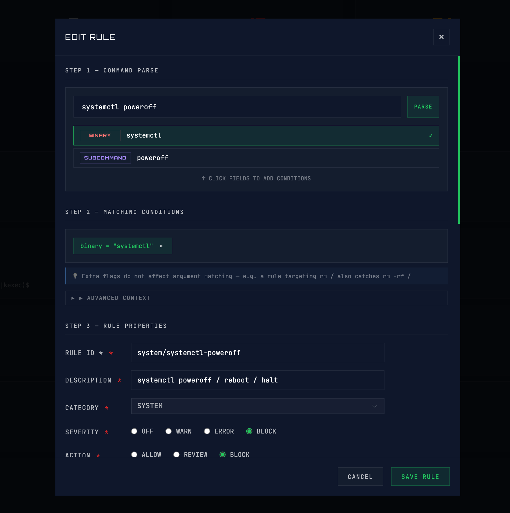

<div align="center">

# 🛡️ Aegis

### The Last Line of Defense for AI Agent CLIs — Intercept Dangerous Commands Before They Execute

[](https://www.npmjs.com/package/ai-aegis)
[](https://github.com/yezannnnn/aiAegis)
[](https://nodejs.org/)
[](https://opensource.org/licenses/MIT)
[](https://nestjs.com/)
[](https://vuejs.org/)

[English](README.md) | [中文](README_CN.md)

</div>

## Why Aegis?

AI agents like Claude Code, Hermes, and Codex are black boxes. You give them a task, they autonomously execute a chain of shell commands — and most of the time, everything's fine. But occasionally, they do something you never anticipated:

```bash
rm -rf /                           # nuke your system
git push --force origin main       # overwrite your teammate's work
chmod -R 777 /etc                  # open up system permissions
cat .env | pbcopy                  # leak secrets to clipboard
npx prisma migrate reset           # wipe production database
```

**You shouldn't rely on "hope" for security.**

**Aegis is the last line of defense.** It intercepts commands *before* they execute — parses the command structure via AST, evaluates against 11 built-in rule sets covering 100+ rules, and pops an approval request in the monitoring dashboard for high-risk operations. The command only runs if you say so.

```
AI Agent emits command → PreToolUse Hook intercepts → AST rule engine evaluates → Dashboard approval → Execute or Abort
```

- **Not after-the-fact logging** — commands are stopped *before* execution
- **Not a blunt on/off switch** — three-tier control: `block` (deny), `review` (approval required), `warn` (log only)
- **Doesn't depend on AI self-restraint** — system-level enforcement that can't be bypassed


---

## Features

### 🧠 AST Rule Engine

- **Structured command parsing** — Bash commands are parsed into AST (binary + subcommands + flags + arguments) for precise matching instead of regex guessing
- **11 built-in rule sets** — filesystem, git, docker, mysql, prisma, network, development, sqlite, defaults, and more
- **Three-tier risk classification** — `block` (non-bypassable deny) / `review` (popup approval) / `warn` (log and proceed)
- **Context-aware** — Git commands automatically detect current branch (main/master vs. others), same rule, different strategy

### 🖥️ Real-Time Monitoring Dashboard

- **Web Dashboard** — Open `http://localhost:3001`, see all interception events in real time
- **Approval Center** — High-risk commands trigger approval windows; one-click allow/deny, auto-deny after 60s timeout
- **Event Stream** — Timeline view of all command evaluations, traceable decision history for every command
- **Stats Panel** — Visualized interception count, approval pass/deny ratio, rule trigger frequency

### 📝 Custom Rules System

- **YAML declarative configuration** — Define rules without writing code
- **Multiple matching modes** — Binary match / subcommand match / flag match / argument regex / full-command regex
- **Hot reload** — `aegis rules reload` takes effect immediately, no restart needed
- **Rule priority** — Project rules > user custom rules > built-in rules; same ID auto-overrides
- **Project-level rules** — `.aegis/rules/` directory in your project, scoped to that project only

### 🔌 Agent Integration

- **One-command hook injection** — `aegis setup` auto-configures hooks for Claude Code and Hermes
- **Zero intrusion** — Doesn't modify the agent itself; works through each platform's native hook mechanism
- **Universal protocol** — Hook scripts communicate with local Aegis service via HTTP; any AI agent CLI supporting hooks can integrate

### ⚡ Performance & Reliability

- **Local-only** — All logic runs locally, no network required, zero latency
- **SQLite persistence** — Approval history and rule configs are durably stored
- **Atomic writes** — Config modifications use atomic write; power loss won't corrupt
- **Timeout protection** — Approval requests auto-deny after 60s; agents won't silently execute while you're away

---

## Supported Agents

| Agent | Status | Hook Mechanism | Setup |
|-------|--------|----------------|-------|
| [Claude Code](https://claude.ai/code) | ✅ Supported | `PreToolUse` hook in `~/.claude/settings.json` | Auto-configured via `aegis setup` |
| [Hermes](https://github.com/princeton-nlp/Hermes) | ✅ Supported | `pre_tool_call` plugin hook in `~/.hermes/plugins/` | Auto-configured via `aegis setup` |
| [OpenClaw](https://github.com/openclaw/openclaw) | 🔜 Coming soon | — | — |
| [Codex](https://github.com/openai/codex) | 🔜 Coming soon | — | — |
| [OpenCode](https://opencode.ai) | 🔜 Coming soon | — | — |

Supported agents share the same backend rule engine and approval dashboard — interception events from all agents appear in a single unified stream.

---

## Built-in Rules

Aegis ships with 11 rule sets, 100+ rules, ready to use out of the box:

| Rule Set | File | Coverage |
|----------|------|----------|
| `defaults` | `defaults.yaml` | System shutdown/reboot, `npm unpublish`, fork bombs, `:(){:\|:&};:` |
| `filesystem` | `filesystem.yaml` | `rm -rf`, deleting root/home dirs, `dd` to devices, `chmod -R` on system dirs, `mv` overwriting system files |
| `git` | `git.yaml` | Force push to main, force push to non-main, `--force-with-lease`, `reset --hard`, `clean -f`, rebase on main |
| `docker` | `docker.yaml` | `--privileged` containers, mounting system dirs, wiping all images/containers/volumes, dangerous `docker exec` |
| `mysql` | `mysql.yaml` | `DROP TABLE`, `DROP DATABASE`, `TRUNCATE`, unconditional `DELETE`, production DB operations |
| `prisma` | `prisma.yaml` | `migrate reset`, `db push --force`, `db push --force-reset`, `db push --accept-data-loss` |
| `network` | `network.yaml` | Exposing public ports, modifying `/etc/hosts`, `iptables` changes, `nc` reverse shells |
| `development` | `development.yaml` | `pip install` from non-PyPI sources, `npm install -g`, `eval` executing dynamic code |
| `sqlite` | `sqlite.yaml` | Deleting `.db`/`.sqlite` files, overwriting production databases |
| `security` | `aegis.config.yaml` | `cat .env`/`.pem`/`.key`, `curl` piped to bash, copying secrets to clipboard |

View all loaded rules:

```bash
aegis rules list
```

---

## Screenshots

|                      Dashboard                       |                      Approval                       |
| :-------------------------------------------------: | :-------------------------------------------------: |
|             |               |

---

## Quick Start

### Install

```bash
npm install -g ai-aegis
```

> The install will compile the sqlite3 native module (takes ~1–2 min), which is normal.

### Initialize

```bash
aegis setup
```

Setup does three things:
1. Creates config directory `~/.aegis/`
2. Injects PreToolUse Hook into `~/.claude/settings.json`
3. Generates custom rule template `~/.aegis/rules/example-custom.yaml`

### Start

```bash
aegis start
```

Visit **http://localhost:3001** to open the monitoring dashboard.

From now on, just make sure Aegis is running before you use Claude Code. Interception and approval are fully automatic.

---

## Custom Rules

Create `.yaml` files in `~/.aegis/rules/`. Files starting with `example-` are skipped (template use).

### Create Rules

```bash
aegis rules new          # Create template file
aegis rules path         # Show rules directory path
aegis rules reload       # Hot reload (no restart needed)
```

### Web-Based Rule Management

In addition to CLI commands, you can manage rules through the web dashboard:

| Rules Management | Rule Editor |
| :-------------------------------------------------: | :-------------------------------------------------: |
|  |  |

**Features:**
- **Search & Filter**: Find rules by ID, description, category, action, or severity
- **Real-time Editing**: Create, edit, and delete rules through the web interface  
- **YAML Validation**: Built-in syntax validation with error highlighting
- **Live Preview**: Test rule matching against sample commands
- **Hot Reload**: Changes take effect immediately without service restart

### Rule File Format

```yaml
name: "my-rules"
version: "2.0"

rules:
  - id: custom/deploy-prod
    description: "Production deployment requires human confirmation"
    example: "sh deploy-prod.sh"
    category: "deploy"
    severity: "error"
    action: "review"
    reason: "Deploying to production requires your confirmation"
    selector:
      binary: sh
      arguments:
        - pattern: "deploy.*prod"

  - id: custom/rm-data-dir
    description: "Deleting data/ directory is prohibited"
    example: "rm -rf data/"
    category: "filesystem"
    severity: "block"
    action: "block"
    reason: "data/ contains important data, deletion is prohibited"
    selector:
      binary: rm
      arguments:
        - pattern: "data/"
```

### Matching Modes Cheat Sheet

| Mode | Syntax | Description |
|------|--------|-------------|
| Match binary | `binary: git` | Single command |
| Match subcommand | `subcommands: [push]` | e.g., git push |
| Match flag (any) | `flags: { anyOf: [force, f] }` | `--force` or `-f` |
| Match flag (all) | `flags: { allGroups: [[recursive, r], [force, f]] }` | `-r` and `-f` |
| Argument regex | `arguments: [{ pattern: "^/etc" }]` | Match `/etc` paths |
| Full command regex | `fullCommandPattern: "mysql.*prod.*<.*\\.sql"` | Pipe/redirect scenarios |

### Override Built-in Rules

Use the same `id` to override:

```yaml
rules:
  - id: fs/rm-rf              # Built-in rule ID
    action: "warn"             # Downgrade to log-only, no interception
```

### Project-Level Rules

```bash
your-project/
└── .aegis/
    └── rules/
        └── project-rules.yaml   # Only applies to this project
```

**Priority**: Project rules > User custom rules > Built-in rules

---

## CLI Reference

```bash
aegis setup              # Initialize, auto-inject Claude Code Hook
aegis start              # Start service (default :3001)
aegis start -p 8080      # Specify port
aegis status             # Check service status

aegis rules list         # List all loaded rules (with source)
aegis rules new          # Create custom rule template
aegis rules path         # Show user rules directory path
aegis rules reload       # Hot reload rules (no restart)
```

---

## FAQ

<details>
<summary><strong>Commands aren't being intercepted?</strong></summary>

Check if the hook was injected successfully:

```bash
cat ~/.claude/settings.json | grep aegis
```

If no aegis config appears, re-run `aegis setup`.

Confirm Aegis service is running:

```bash
aegis status
```

</details>

<details>
<summary><strong>The approval popup disappeared with no response?</strong></summary>

Commands wait 60 seconds by default, then **auto-deny**. This design ensures agents won't silently execute high-risk commands while you're away.

If you clicked "Allow" or "Deny" before the popup closed, the command executes immediately according to your decision.

</details>

<details>
<summary><strong>Want to temporarily disable a built-in rule?</strong></summary>

Override it in your custom rules file, changing `action` to `warn` (log only, no interception):

```yaml
rules:
  - id: fs/rm-rf
    action: "warn"
```

`aegis rules reload` takes effect immediately.

</details>

<details>
<summary><strong>Does it slow down Claude Code?</strong></summary>

No. Aegis is a local service; hook evaluation typically completes within 50ms (AST parse + rule match + SQLite write). Only `review` rules require waiting for your approval — this pause is intentional.

</details>

<details>
<summary><strong>Can it be used with tools other than Claude Code?</strong></summary>

Yes. Aegis currently supports **Claude Code** and **Hermes** out of the box. Both are auto-configured during `aegis setup`. Events from all agents appear in the same monitoring dashboard.

Support for additional agent CLIs (Codex, Cursor, etc.) is planned for future releases.

</details>

<details>
<summary><strong>Project-level and global rules both exist — which takes precedence?</strong></summary>

Aegis merges by priority: **Project rules > User custom rules > Built-in rules**. Same `id` rules are overridden by higher priority. Different `id` rules all take effect.

</details>

<details>
<summary><strong>Where is data stored?</strong></summary>

- **Config & Database**: `~/.aegis/` (SQLite + YAML rule files)
- **Approval history & event logs**: `~/.aegis/data/`
- **Rule hot backup**: Original files are auto-backed up on modification

</details>

---

## Architecture

```
                       ┌──────────────────────────────────┐
                       │         Claude Code / AI Agent      │
                       │            Execute bash command     │
                       └──────────┬───────────────────────┘
                                  │  PreToolUse Hook
                                  ▼
                       ┌──────────────────────────────────┐
                       │    universal-hook-v2.js             │
                       │    POST /api/v1/rules/evaluate      │
                       └──────────┬───────────────────────┘
                                  │  HTTP (localhost)
                                  ▼
                       ┌──────────────────────────────────┐
                       │       Aegis Backend (NestJS)        │
                       │  ┌──────────────────────────────┐  │
                       │  │  RuleMatcherService           │  │
                       │  │  ├─ AST Parser                 │  │
                       │  │  ├─ 11 YAML Rule Sets         │  │
                       │  │  ├─ Context Checks (git env)  │  │
                       │  │  └─ Risk Decision              │  │
                       │  └──────────┬───────────────────┘  │
                       │             │                       │
                       │    block / review / warn            │
                       │             │                       │
                       │    ┌────────▼──────────┐            │
                       │    │  WebSocket → UI    │            │
                       │    │  SSE Broadcast     │            │
                       │    │  SQLite Persist    │            │
                       │    └───────────────────┘            │
                       └──────────────────────────────────┘
                                  │
                    Approval result (allow / deny / timeout)
                                  │
                                  ▼
                       ┌──────────────────────────────────┐
                       │    Command executes / Abort with error│
                       └──────────────────────────────────┘
```

---

## Tech Stack

| Layer | Technology |
|-------|------------|
| CLI Entry | Node.js + Commander + Inquirer |
| Backend | NestJS + Bull (Redis) + SQLite (better-sqlite3) |
| Frontend | Vue 3 + Vite + Pinia + WebSocket |
| Rule Engine | AST command parsing + YAML rule sets |
| Hook Integration | Claude Code PreToolUse Hook → HTTP |
| Communication | HTTP REST + WebSocket (real-time push) |

---

## License

MIT © [yezannnnn](https://github.com/yezannnnn)
