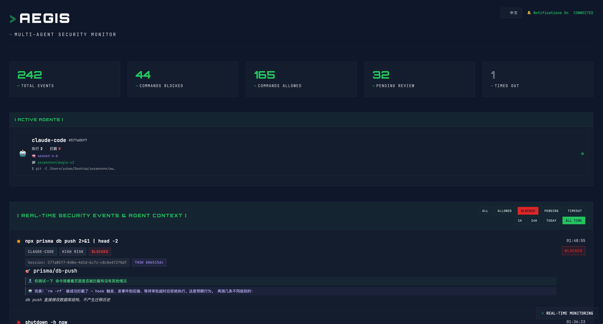
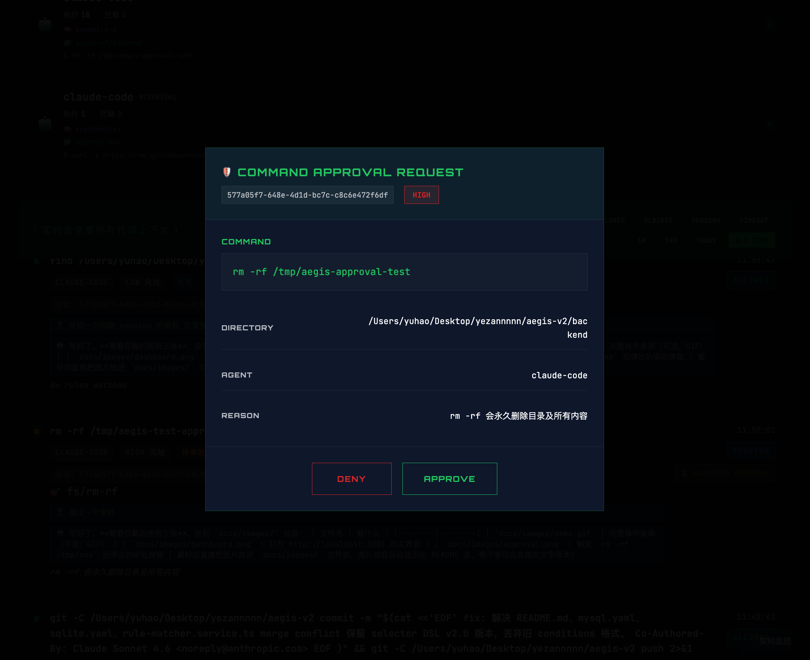

# My AI agent wiped my database twice. So I built a command firewall.

> I was building a customer service agent with Claude Code. In the span of one week, the AI wiped my local database twice. The first time I thought it was an accident. The second time I realized it was a systemic problem — and that no existing tool was going to fix it for me.

---

## The first time: I thought it was a fluke

I asked Claude Code to sync the database schema. It ran:

```bash
npx prisma migrate reset --force
```

Schema synced. I opened my database client. **Two weeks of test data, debug records, and simulated orders — gone.**

I typed into the chat: *"Never use `--force` flags on database commands."*

*"Understood, I'll remember that,"* it replied.

I believed it.

---

## The second time: I understood what AI memory actually is

One week later. Different feature, different context window.

It ran the same command again. **Database wiped again.**

This time I went further. I added the rule to the project memory, to the system prompt, to `.claude.md`, to the conversation header. I triple-checked every file.

And then, mid-checklist, I understood something:

> **AI agents don't have *caution*. They have probabilities.**

When you tell a model "never do X," it doesn't form a rule — it shifts a probability. Under normal conditions, that probability is high enough. But when the context gets complex, when the task gets long, when token pressure builds — the probability drops. The model isn't disobeying you. It's *statistically drifting*.

This is why AI memory feels like a hallucination:
- Rules you set in one session don't carry over to the next
- In long tasks, safety instructions get buried under new context
- The same command executed through a different path looks "different" to the model

**I couldn't keep betting my data on a probability.**

And I realized this wasn't just my problem. Anyone running AI agents against real systems — databases, filesystems, git repos, production servers — faces the same structural risk.

---

## What existing tools miss

Claude Code has built-in safety checks. But they're designed for obvious universal dangers:

| Command | Built-in safety | My reality |
|---------|----------------|------------|
| `rm -rf /` | ✅ Blocked | Never encounter this |
| `npx prisma migrate reset --force` | ❌ Not recognized | **Hit this weekly** |
| `docker system prune -a` | ❌ Not recognized | Common cleanup |
| `npx prisma db push --force` | ❌ Not recognized | Common during dev |

Built-in safety protects against "things everyone can see are dangerous." But the real hazards live in your specific tech stack — the Prisma commands, the Docker cleanup scripts, the deployment shortcuts that only *you* know are landmines in your project.

This isn't a solvable problem for generic tooling. Every developer's stack is different:
- I use Prisma + NestJS + Docker
- You use Django + PostgreSQL + K8s  
- Someone else uses Rust + SQLite + custom deploy scripts

**No universal tool can know where your specific mines are buried.**

---

## This isn't just me

On April 27, 2026, a developer named jeremyccrane's AI agent ran `DROP DATABASE` in production. Data permanently lost. The HN thread hit 450+ upvotes and 620+ comments.

My two incidents were in local dev — the data was rebuildable. His was production. But they point to the same root problem: **AI agents don't have a permission boundary that matches the blast radius of their actions.**

---

## What I built: Aegis

I built a tool called **Aegis** (the divine shield from Greek mythology). It's a command firewall for AI agents — it intercepts dangerous commands *before* they execute and routes them to a web dashboard for human approval.

```
AI Agent issues a command
        ↓
PreToolUse Hook intercepts
        ↓
AST rule engine evaluates risk
        ↓
   block → rejected immediately
   review → approval popup in dashboard  
   warn → logged, allowed through
   allow → passed through silently
```

The key design decision: **Aegis hooks into Claude Code's `PreToolUse` hook mechanism** — a standard event that fires before any tool executes. This means Aegis sits between the model's decision and the actual execution. Not after. Before.



---

## The rule system

Aegis ships with 11 built-in rule sets covering common risks (git, docker, filesystem, mysql, prisma, network, etc.). But the rules that will actually save you are the ones you write yourself.

Here's the Prisma rule set I wrote after my second incident:

```yaml
name: "my-prisma"
version: "2.0"

rules:
  - id: my/prisma-migrate-reset
    description: "migrate reset --force wipes all data"
    example: "npx prisma migrate reset --force"
    category: "database"
    severity: "error"
    action: "review"
    reason: "This will delete all data and re-apply migrations from scratch"
    selector:
      binary: npx
      arguments:
        - pattern: "prisma.*migrate.*reset"
      flags:
        anyOf: [force]

  - id: my/prisma-db-push-force
    description: "db push --force overwrites schema without migration"
    example: "npx prisma db push --force"
    category: "database"
    severity: "error"
    action: "review"
    reason: "Force push can cause data loss if schema changes are destructive"
    selector:
      binary: npx
      arguments:
        - pattern: "prisma.*db.*push"
      flags:
        anyOf: [force]
```

```bash
aegis rules reload   # changes take effect instantly, no restart needed
aegis rules list     # see all active rules with their source
```

Rules use a YAML selector DSL — no code required. Hot reload means you can iterate on your rules while Claude Code is running. Full DSL reference: [docs/rules-authoring.md](./rules-authoring.md)

**Your rules have the highest priority.** Same `id` overrides any built-in rule.

---

## The approval dashboard

When a `review`-level command fires, a popup appears in the web dashboard at `http://localhost:3001`:



You see:
- The exact command the agent wants to run
- Which rule triggered it and why
- The working directory and agent context
- One-click allow or deny

**If you don't respond within 60 seconds, it auto-denies.** The agent gets an error and stops. This is intentional — if you step away from your machine, no command should silently execute.

The timeout is configurable in `~/.aegis/config.json`:
```json
{
  "approvalTimeoutSeconds": 60
}
```

---

## How my workflow changed

1. `aegis start` — runs in background
2. Open Claude Code, work normally
3. Agent tries to run `prisma migrate reset --force`
4. Aegis intercepts, dashboard popup appears
5. I glance at it: *"Oh, this time I actually need the reset — allow"* or *"Wait, that would nuke my test data — deny"*
6. Agent continues or gets an error and explains why it was blocked

**I no longer rely on the agent "remembering" anything. I rely on: dangerous operations must pass through me.**

---

## Installation

```bash
npm install -g ai-aegis

aegis setup    # injects PreToolUse hook into ~/.claude/settings.json
aegis start    # starts backend + dashboard at http://localhost:3001
```

Then use Claude Code as normal. Aegis runs silently until something triggers a rule.

---

## Current state and roadmap

**Works today:**
- Claude Code (PreToolUse hook integration)
- macOS and Linux
- 11 built-in rule sets, 100+ rules
- Custom YAML rules with hot reload
- Project-level rules (`.aegis/rules/` in your repo)
- Web dashboard with real-time event stream

**Planned:**
- Hermes, Codex CLI, OpenCode hook support
- Windows support
- Session audit log (full timeline of what the agent did)
- Code diff snapshots before agent edits (one-click rollback without polluting git history)

---

## One line

> Built-in safety protects against dangers everyone can see. Aegis protects against the hazards only *you* know exist in your stack.

Your AI agent isn't trying to harm you. It just doesn't have the concept of caution. Aegis is the net that catches it when it drifts.

---

MIT licensed. [github.com/yezannnnn/aiAegis](https://github.com/yezannnnn/aiAegis)

```bash
npm i -g ai-aegis && aegis setup && aegis start
```
